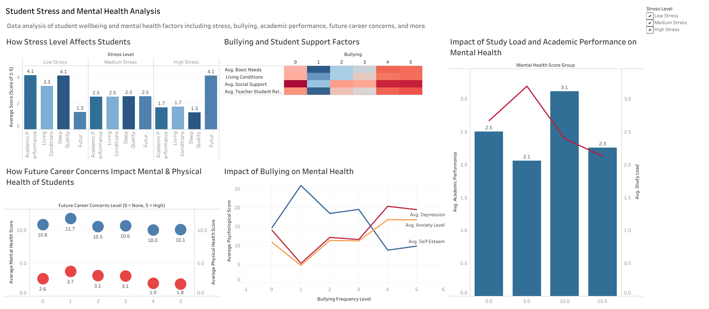

# Analyzing Key Factors Behind Student Stress

## Project Overview

This project explores the factors associated with student stress using survey data. As a recent graduate, I wanted to see whether students are still dealing with many of the same pressures I experienced. I focused on sleep, living conditions, academic performance, future career concerns, bullying, and support systems, then translated the patterns into practical recommendations for schools.

## Tools Used

- Microsoft Excel
- Tableau

## Data Description

**Source:** [Student Stress Monitoring Datasets (Kaggle)](https://www.kaggle.com/datasets/mdsultanulislamovi/student-stress-monitoring-datasets/data)

**More Details:** The analysis uses StressLevelDataset.csv, which contains 1,100 student records and 21 columns covering psychological, physiological, environmental, academic, and social factors. The target variable classifies stress as low (0), medium (1), or high (2).

## Methodology

### Step 1: Data Cleaning

- Used Find and Replace to remove underscores from column headers.
- Applied the PROPER function to make column headers easier to read.
- Converted the dataset into an Excel table using Ctrl + T.
- Used Remove Duplicates and confirmed there were no duplicate rows.
- Applied conditional formatting to check for blank cells; none were found.
- Reviewed the valid ranges and distributions for each column to identify unusual values. I retained the higher anxiety, self-esteem, and depression scores because they were within the documented range of the source data.

### Step 2: Data Analysis

- Created PivotTables to compare stress levels with average sleep quality, living conditions, academic performance, and future career concerns.
- Compared bullying frequency with average anxiety, depression, and self-esteem.
- Explored whether basic needs, living conditions, teacher-student relationships, and social support varied across bullying levels.
- To support additional comparisons, I created two exploratory composite variables:
  - **Mental Health Score:** combined anxiety, depression, self-esteem, and sleep quality.
  - **Physical Health Score:** combined headache frequency, blood pressure, and breathing problems.

  I used these composite scores to compare broad patterns across groups. Since the source variables use different ranges and coding directions, I treated the scores as exploratory indicators rather than validated measures of student health.

  **Limitation:** a future version of this analysis would normalize each input before averaging so that every factor contributes equally.

- Grouped the exploratory mental health score into 5-point ranges and compared each group with average academic performance and study load.
- Compared average mental and physical health scores across future career concern levels from 0 (none) to 5 (high).

## Key Findings

**Mental Health vs. Academic Performance**

The score group around 10 recorded the highest average academic performance (3.1), while the group around 5 recorded the lowest (2.1). The highest score group, shown at 15 on the dashboard, had the lowest average study load but still had relatively weak academic performance (2.3). The chart does not explain why, so I would treat this as a question for further analysis rather than evidence of low motivation.

**Bullying and Its Impact on Mental Health**

Comparing students at bullying level 5 with those at level 0:

- Average anxiety increased by **55%** (10.82 to 16.81)
- Average depression increased by **39%** (14.02 to 19.48)
- Average self-esteem decreased by **33%** (14.69 to 9.81)

The endpoint comparison shows a clear difference in mental health outcomes. However, the pattern is not consistent across every bullying level; level 1, for example, has unusually positive results. Without group sizes or statistical testing, I would describe this as an association rather than proof that bullying alone caused the changes.

**Future Career Concerns**

Students at future career concern level 1 reported the highest average mental (11.7) and physical (3.7) health scores. Scores were lowest at concern levels 4 and 5, while levels 2 and 3 were close to the no-concern group. This suggests that some career awareness may be manageable, while higher concern is associated with poorer health scores. The chart does not show that career concern directly causes those outcomes.

**Stress Levels & Lifestyle Factors**

Comparing students at stress level 2 (high) with those at stress level 0 (low):

- Average sleep quality decreased from **4.13 to 1.30**
- Average living conditions decreased from **3.31 to 1.72**
- Average academic performance decreased from **4.14 to 1.66**
- Average future career concern increased from **1.33 to 4.10**

High-stress students reported poorer sleep, living conditions, and academic performance, along with much greater career concern. Sleep quality showed the largest absolute change between the low- and high-stress groups (2.83 points), closely followed by future career concerns (2.77 points).

**Bullying and Support System**

Support scores generally weakened at the highest bullying levels, especially levels 4 and 5.

- Students at bullying level 1 showed the strongest overall support across the four categories.
- The pattern was not perfectly consistent: the no-bullying group had weaker social support than expected, so the chart should not be described as a steady decline from levels 0 to 5.

Overall, higher bullying frequency was associated with weaker support in several areas, but the dashboard does not establish which factor came first. The results support further investigation into how basic needs, living conditions, teacher relationships, and social support may relate to bullying.

## Key Visuals

**[View the live interactive dashboard on Tableau Public](https://public.tableau.com/views/StudentStressandMentalHealthAnalysis/StudentStressandMentalHealthAnalysis?:language=en-US&:display_count=n&:origin=viz_share_link)**

## Conclusion and Recommendations

Taken together, the dashboard shows that high stress is associated with poorer sleep, living conditions, and academic performance, as well as greater future career concern. Sleep quality and career concerns show the largest differences between low- and high-stress students. Bullying level 5 is also associated with higher anxiety and depression and lower self-esteem than level 0. Because the analysis is based on cross-sectional survey averages, these findings show relationships, not cause and effect.

**Provide Earlier Career Support.** Students at concern level 1 had the strongest health scores, while levels 4 and 5 had the weakest. Schools could offer career counselling, internship guidance, and practical planning earlier so students feel informed before career uncertainty becomes overwhelming.

**Strengthen Student Support Systems.** The heatmap suggests that students at the highest bullying levels often report weaker basic needs, living conditions, teacher relationships, and social support. Schools could pair anti-bullying programs with accessible student services and stronger teacher check-ins. These steps are reasonable interventions, although the chart does not prove they would directly reduce bullying.

**Make Mental Health Support Available to All Students.** Bullying is one of several factors connected with student well-being in this dataset. Campus mental health resources should therefore be available and normalized for the wider student population, not positioned only as a response to bullying.

**Investigate the Highest Mental Health Score Group.** The group shown at 15 had the lowest study load but only 2.3 average academic performance. It did not have the worst performance (that was the group shown at 5, which was lower at 2.1), but the result still deserves follow-up. Additional survey questions about motivation, course difficulty, outside responsibilities, or engagement could help explain the pattern.

**Use Sleep and Living Conditions as Check-In Topics.** Sleep quality and living conditions both decline as stress rises, so they could be useful topics in regular student check-ins. Because this analysis is cross-sectional, I would treat them as potential indicators of current stress rather than proven early warning signals.
